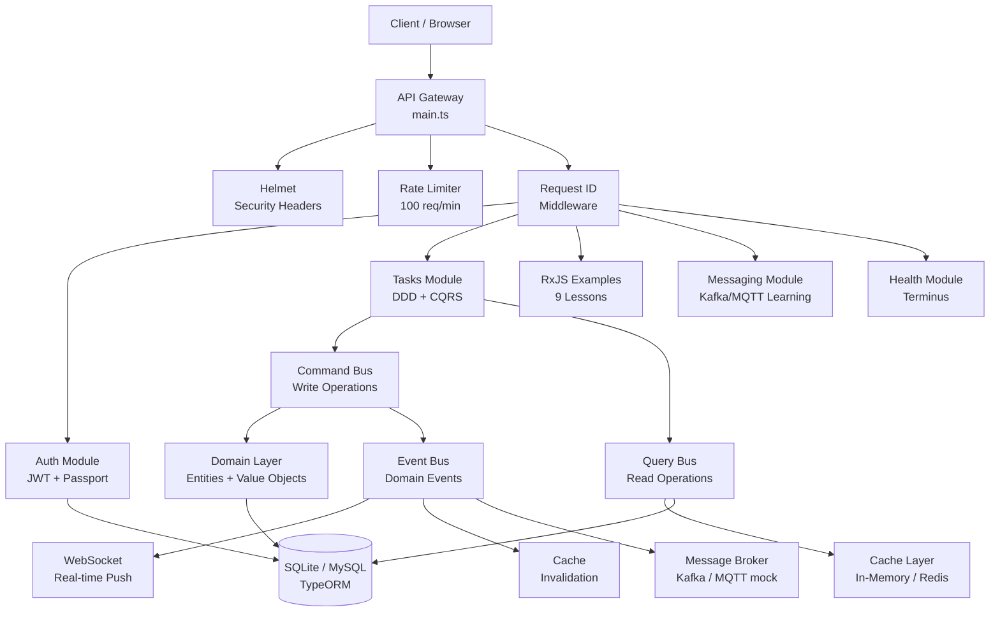
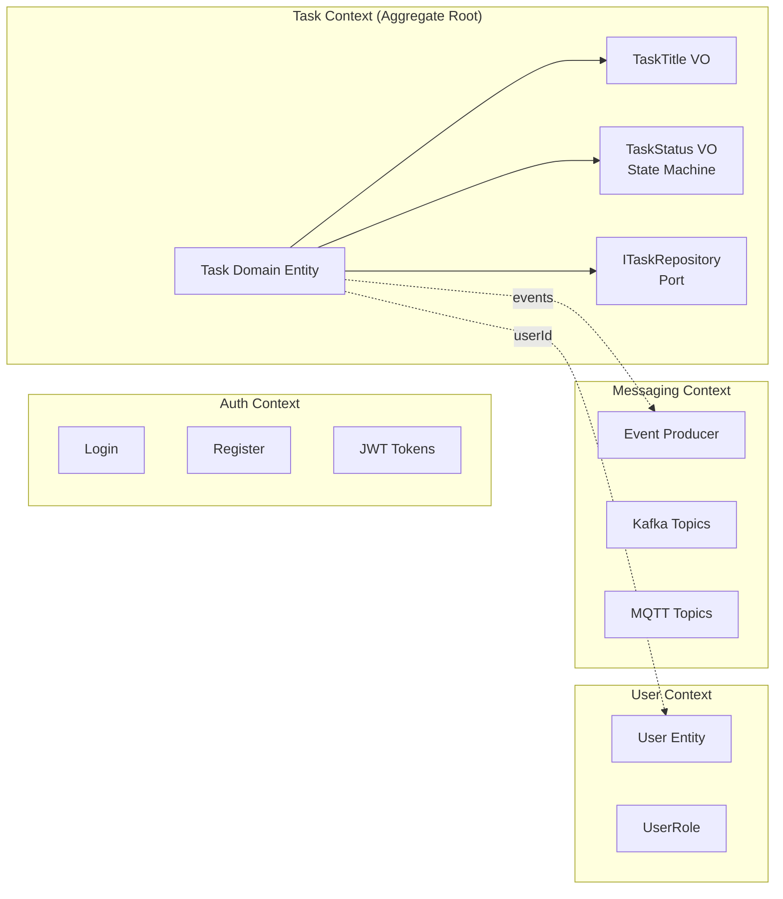
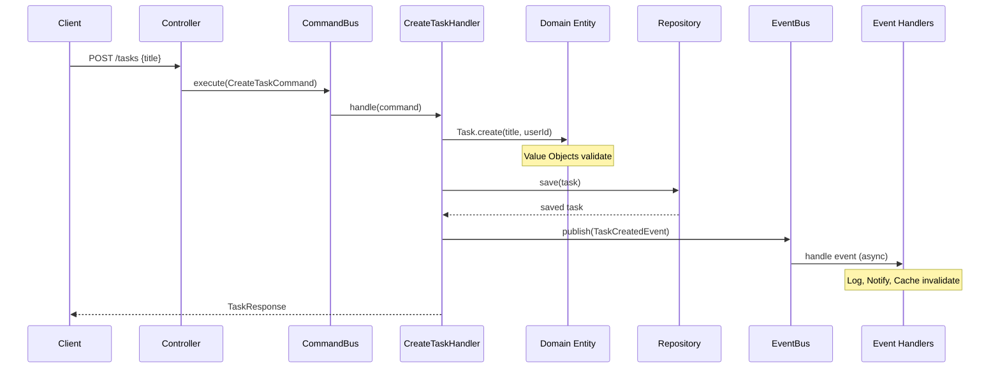

# System Design — NestJS + RxJS Task Management

## Architecture Overview



## DDD Bounded Contexts



## CQRS Flow



## Layer Dependencies

```
┌─────────────────────────────────────────────┐
│                INFRASTRUCTURE               │
│  Controllers, TypeORM, Kafka, Redis         │
│  (depends on Application + Domain)          │
├─────────────────────────────────────────────┤
│                APPLICATION                  │
│  Commands, Queries, Events, DTOs, Mappers   │
│  (depends on Domain only)                   │
├─────────────────────────────────────────────┤
│                   DOMAIN                    │
│  Entities, Value Objects, Events, Ports     │
│  (depends on NOTHING - pure TypeScript)     │
└─────────────────────────────────────────────┘

Arrow direction: outer → inner (Dependency Rule)
NEVER: Domain → Infrastructure
```

## Key Design Decisions

| Decision | Choice | Rationale |
|----------|--------|-----------|
| DB | SQLite (dev), MySQL (prod) | Zero-setup development |
| Auth | JWT + Refresh Token Rotation | Stateless, secure revocation |
| Architecture | DDD + CQRS within Monolith | Learn patterns without microservice complexity |
| Messaging | In-memory mock broker | Docker-free, same code structure as production |
| Caching | In-memory (Redis-ready) | No external deps, swap to Redis with 1 config change |
| Real-time | Socket.IO + RxJS Subject | Reactive event-driven notifications |
